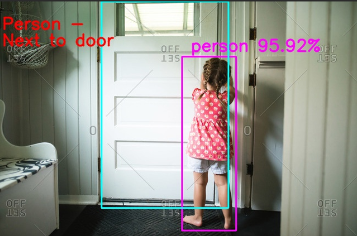
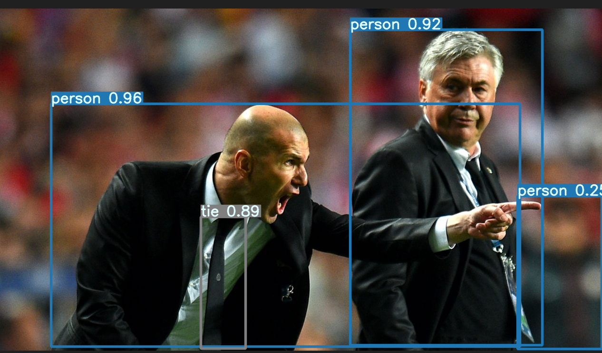
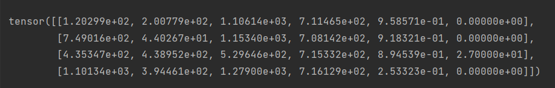

# monitor_kids

Implement a system to detect the presence of people in proximity to the door.



## Curriculum

### Module 1: AI Introduction

1. AI and Sklearn
    * Topics
        * The Introduction to AI
        * AI in Actions with Sklearn
    * References
        * Lecture Slides (
          pptx): [Link](https://drive.google.com/file/d/1QaDNCroT7mR968lUs_43RR8QSu08eNkE/view?usp=sharing)
        * Lecture Slides (
          keynote): [Link](https://docs.google.com/presentation/d/1QfNrK_L4GrO6FQyZTCdpSGkWpw2EHN3M/edit?usp=sharing&ouid=104361959057037146246&rtpof=true&sd=true)
        * Lecture sample: https://youtu.be/EjFanvsr-vk
        * Repl code sample: https://replit.com/@sunyu912/ForsakenTanConversions#main.py
    * Milestone and Goals
        * Student understands the major AI/Machine Learning concept (i.e., dataset, training, prediction)
        * Student understands the basic Sklearn Iris flower classification example code

2. Computer Vision to read a video/image

- OpenCV Get Started

    - Setup environment

    - Introduction to OpenCV

        - https://learnopencv.com/getting-started-with-opencv/
    - Process image:
        - Run the read, display and write an image example (with an image)

            - https://learnopencv.com/read-display-and-write-an-image-using-opencv/
        - Run the image resizing example (with an image)

            - https://learnopencv.com/image-resizing-with-opencv/
        - Run the putText example
            - https://www.geeksforgeeks.org/python-opencv-cv2-puttext-method/
        - Run rectangle example
            - https://www.geeksforgeeks.org/python-opencv-cv2-rectangle-method/
    - Process video
        - Run the read, display and write an video example (with a video)
            - From File
                - https://learnopencv.com/reading-and-writing-videos-using-opencv/

```
              import cv2 

              # Create a video capture object, in this case we are reading the video from a file
              vid_capture = cv2.VideoCapture('<file_path.mp4>') # For webcam change <file_path.mp4> to 0. Eg. vid_capture = cv2.VideoCapture(0)

              if (vid_capture.isOpened() == False):
                print("Error opening the video file")
              # Read fps and frame count
              else:
                # Get frame rate information
                # You can replace 5 with CAP_PROP_FPS as well, they are enumerations
                fps = vid_capture.get(5)
                print('Frames per second : ', fps,'FPS')

                # Get frame count
                # You can replace 7 with CAP_PROP_FRAME_COUNT as well, they are enumerations
                frame_count = vid_capture.get(7)
                print('Frame count : ', frame_count)

              while(vid_capture.isOpened()):
                # vid_capture.read() methods returns a tuple, first element is a bool 
                # and the second is frame
                ret, frame = vid_capture.read()
                if ret == True:
                  cv2.imshow('Frame',frame)
                  # 20 is in milliseconds, try to increase the value, say 50 and observe
                  key = cv2.waitKey(20)
                  
                  if key == ord('q'):
                    break
                else:
                  break

              # Release the video capture object
              vid_capture.release()
              cv2.destroyAllWindows()
```

### Module 2: Learn about YOLOv7

##### Install

Use the requirements.txt that is in this repository

  ```
  pip install -r requirements.txt
  ```

##### Object Detection with YOLOv7

Let's create an instance of the YOLOv7 object

```python
import torch

model = torch.hub.load("WongKinYiu/yolov7", "custom", 'models/yolov7.pt')

```

**The model is store in the models folder**

Let’s use a sample image from the Ultralytics GitHub. We can directly specify the image URL:

```python
# Sample Image URL
BASE_URL = 'https://github.com/ultralytics/yolov5/raw/master/data/images/'
image_url = BASE_URL + 'zidane.jpg'
```

If you have images locally on your computer, you can specify the path to your images. Thus, you will replace the data
that is in the image_url with the path of your image

We create a batch of images (albeit only one image entry) and feed it to the model.

```python
# A batch of images (only one entry here)
imgs = [image_url]

# Inference
results = model(imgs)
```

We can show the result with one line:

```python
# Display the results
results.show()
```



It detected three person objects and one tie objects.

We can save it with one line:

```python
# Save the results
results.save()
```

It creates folders and saves the resulting image: runs/hub/exp/zidane.jpg. If we rerun the experiment, it’ll add a
new folder exp2, and save the image there (the result will be the same if we use the same input image).

##### Bounding Boxes

We can print the bounding box values for the first image in the batch (we only have one image):

```python
print(results.xyxy[0])
```



There are six numbers per row.

- The first four values are for xyxy
- The fifth value is the confidence score
- The sixth value is the predicted object class

For better readability, I rounded the values as follows:

```python
[120, 200, 1106, 711, 96 %, 0]  # Person
[749, 44, 1153, 708, 92 %, 0]  # Person
[435, 438, 529, 715, 89 %, 27],  # tie
[1101, 394, 1279, 716, 25 %, 0]  # person
```

We can compare the above confidence scores and detected classes in the resulting image to confirm they match:

YOLO can detect 80 object classes. We can print all supported classes as follows:

```python
['person', 'bicycle', 'car', 'motorcycle', 'airplane', 'bus', 'train', 'truck', 'boat', 'traffic light', 'fire hydrant',
 'stop sign', 'parking meter', 'bench', 'bird', 'cat', 'dog', 'horse', 'sheep', 'cow', 'elephant', 'bear', 'zebra',
 'giraffe', 'backpack', 'umbrella', 'handbag', 'tie', 'suitcase', 'frisbee', 'skis', 'snowboard', 'sports ball', 'kite',
 'baseball bat', 'baseball glove', 'skateboard', 'surfboard', 'tennis racket', 'bottle', 'wine glass', 'cup', 'fork',
 'knife', 'spoon', 'bowl', 'banana', 'apple', 'sandwich', 'orange', 'broccoli', 'carrot', 'hot dog', 'pizza', 'donut',
 'cake', 'chair', 'couch', 'potted plant', 'bed', 'dining table', 'toilet', 'tv', 'laptop', 'mouse', 'remote',
 'keyboard', 'cell phone', 'microwave', 'oven', 'toaster', 'sink', 'refrigerator', 'book', 'clock', 'vase', 'scissors',
 'teddy bear', 'hair drier', 'toothbrush']

```
We can confirm model.names[0] is person, and model.names[27] is tie.

- Refereces:
    - https://kikaben.com/yolov5-pytorch/
    - https://androidkt.com/how-to-load-local-yolov7-model-using-pytorch-torch-hub/
    - https://github.com/WongKinYiu/yolov7

## Module 3: AI Model
### Train YOLOv7 on a Custom Dataset
  
  - To train our detector we take the following steps:

    1. Install YOLOv7 dependencies
    2. Load custom dataset from Roboflow in YOLOv5 format
    3. Run YOLOv7 training
    4. Evaluate YOLOv7 performance
    5. Run YOLOv7 inference on test images
    6. Deployment
  - References:
    https://colab.research.google.com/drive/1wPzA1zYcMO8_7kwVe8utTDB5ZUY4-n_r?usp=sharing

### Prediction
- Process Image
  - Detect people
  - Detect door
  - Draw boxes
  - Process image
  - Detect if a kid is close to the door
- Process video